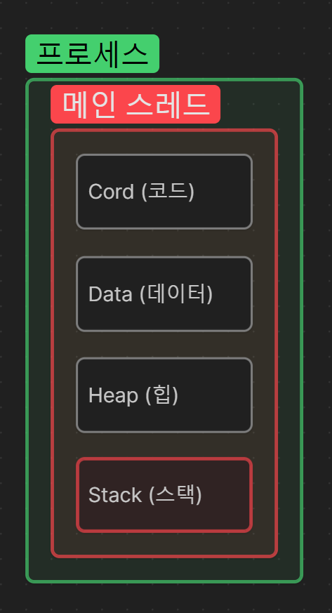
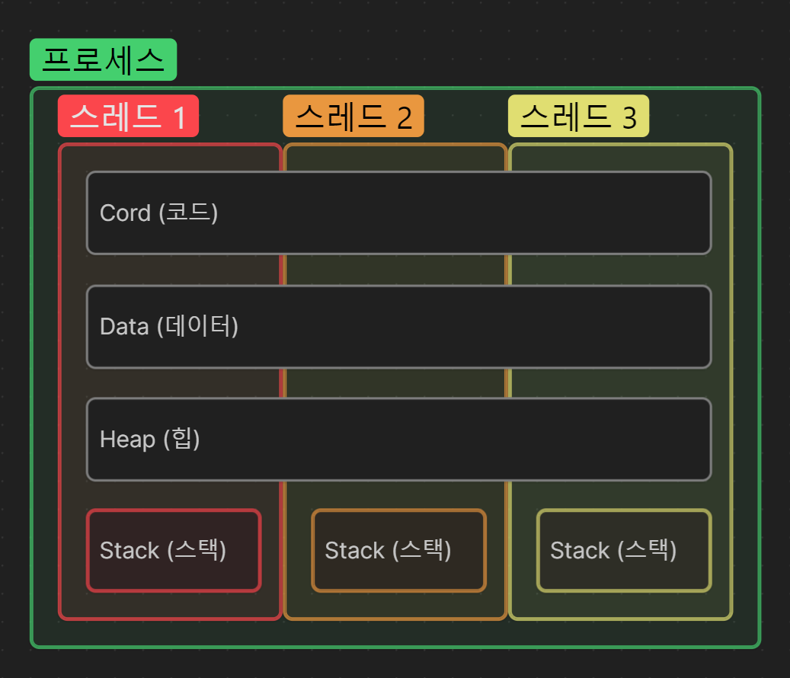

# Process (프로세스)

- 프로세스는 프로그램을 처음 실행할 때, 메모리에 올라가는 코드, 데이터, 힙, 스택으로 이루어진 구조입니다.

    

## Cord (코드)

- 코드 영역은 실행할 프로그램의 코드가 저장되는 영역으로 한번 읽어들인 후, 하나 씩 순차적으로 실행하게 된다.

## Data (데이터)

- 데이터 영역은 프로그램의 전역 변수와 정적(Static) 변수가 저장되는 영역으로 프로그램의 시작과 함께 최초로 할당되고, 이후 프로그램이 종료될 시, 메모리에서 소멸한다.

## Heap (힙)

- 힙 영역은 사용자에 의해 메모리 공간이 동적으로 할당되는 영역으로 Java에서 대표적으로 Instance(인스턴스) 생성될 시, 힙에 올라간다.

## Stack (스택)

- 스택 영역은 함수의 호출과 관계되는 지역 변수와 매개 변수가 저장되는 영역으로
  
---

# Thread (스레드)

- 스레드는 프로세스의 내에 최소 하나 이상 존재하며, 스택을 제외한 나머지 자원들은 프로세스 내에 빌려온다.

    

## Process와 Thread 의 차이는?

- 단위의 차이