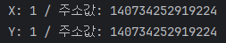

## Python is `Call by Value` or `Call by Reference`?

Python은 특이하게도 메모리에 1이라는 값이 저장되어 있다고 가정한다면
모든 변수에 1을 저장할 때, 반드시 동일한 메모리 주소값을 할당 받는다.

- 예제
```python
X = 1
Y = 1
print(f"X: {X} / 주소값: {id(X)}")
print(f"Y: {Y} / 주소값: {id(Y)}")
```

- 결과
<p align>
    
</p>