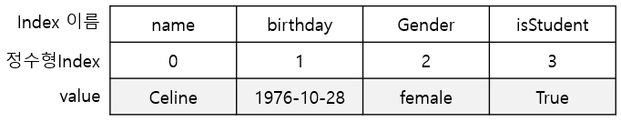

## Series

- 데이터가 순차적으로 나열된 1차원 배열의 형태로 데이터를 저장
    
- Python의 dictionary와 유사한 형태의 자료구조
    
    - index와 Value로 구성됨
        
    - 열벡터 형태의 자료구조
        
    

<p align>
    
</p>

---

시리즈는 데이터 순차적으로 나열된 1차원 배열의 형태를 갖습니다. 위 그림과 같이 index와 data가 일대일 대응이 됩니다. 이런 관점에서 key과 value가 쌍을 이루는 Python의 dictionary와 비슷한 구조를 가진다고 할 수 있습니다.

Series의 index는 데이터의 위치를 나타내는 이름표(데이터의 주소)와 역할을 합니다.
Serise는 list, tuple, dictionary 등에서 생성할 수 있습니다.

---

### list에서 생성

- list에서 Series생성
    
    _pandas.Series(list)_
    
    ```python
    list = ['2023-12-30', 3.14, 'Celine', True]
    series = pd.Series(list)
    ```
    
    <p align>
        
    </p>

    

---

### tuple에서 생성

- tuple에서 Series 생성
    
    _pandas.Series(tuple)_
    
    ```python
    tup = ('Celine', '1976-10-28', 'femail', True)
    # 인덱스 옵션 지정
    series = pd.Series(tup, index=['name','birthday','gender', "isStudent"])
    ```
    
    <p align>
        
    </p>
    

---

### Dictionary에서 생성

- Dictionary에서 Series 생성
    
    _pandas.Series(dictionary)_
    
    ```python
    dict = {'name': 'Celine', 'birthday': '1976-10-28', 'gender': 'female', 'isStudent': True}
    series = pd.Series(dict)
    series
    ```
    
    <p align>
        
    </p>
    

생성된 Series는 `pandas.core.series.Series` 타입입니다.

---

### Series 데이터 액세스

Series 객체의 index 속성과 values 속성을 사용하면 값을 불러올 수 있습니다.

인덱스, 인덱스명 사용하여 데이터에 액세스 할 수 있습니다.

아래 그림과 같은 Series가 있으면, 인덱스와 인덱스 이름을 모두 사용할 수 있고, list 형식으로 데이터에 엑세스 할 수 있습니다.

<p align>
    
</p>

```python
series.index
```

```python
Index(['name', 'birthday', 'gender', 'isStudent'], dtype='object')
```

```python
series.values
```

```python
array(['Celine', '1976-10-28', 'femail', True], dtype=object)
```

- 인덱스를 사용하여 하나의 데이터에 액세스
    


- 정수형 인덱스 사용
```python
series[2]
```

```python
'femail'
```


- 생성한 인덱스 사용
```python
series['name']
```

```python
'celine'
```


- list를 사용하여 여러 데이터에 액세스
    ```python
    series[[0, 1]]
    ```
    
    ```python
    name        Celine
    birthday    1976-10-28
	```
    
    ```python
    series[0:4]
    ```
    
    ```python
	name             Celine
    birthday     1976-10-28
    gender           femail
    isStudent          True
	```
    
    ```python
    series['gender']
    ```
    
    ```python
    'female'
	```
    
    ```python
    series[['name', 'gender']]
    ```
    
    ```python
    name      Celine
    gender    female
	```
	

---

